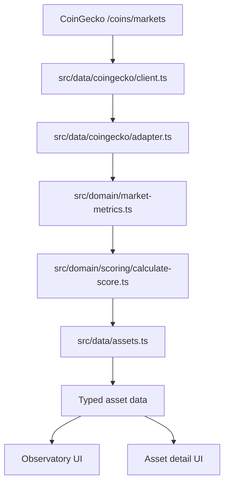
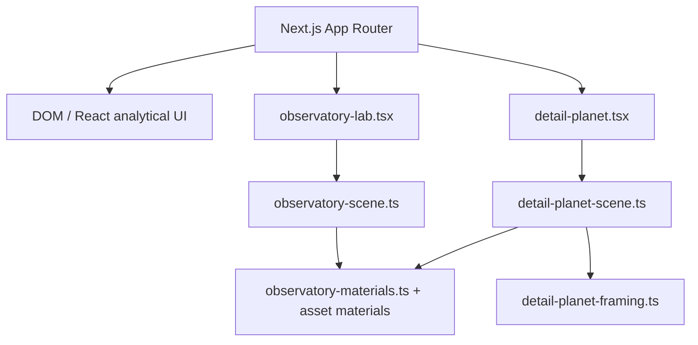
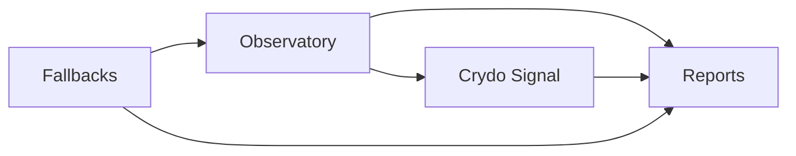

# Crydo — Architecture

## Data architecture

Notes:

- CoinGecko requests are grouped across BTC, ETH, and SOL.
- Validation happens before domain calculations.
- Scoring is deterministic and bounded.
- UI receives typed asset data rather than raw provider payloads.

## Visual architecture

Notes:

- WebGL is a focused visualization layer, not the whole application.
- DOM/React remains responsible for analytics, navigation, and content structure.
- Detail pages reuse the shared material system through a dedicated Three.js scene.

## Product systems overview

Notes:

- The observatory handles exploration and selection.
- The Crydo Signal translates raw market metrics into a bounded reading.
- Reports expand the selected asset into an editorial analytical mode.
- Fallback systems protect usability when data or WebGL fail.
